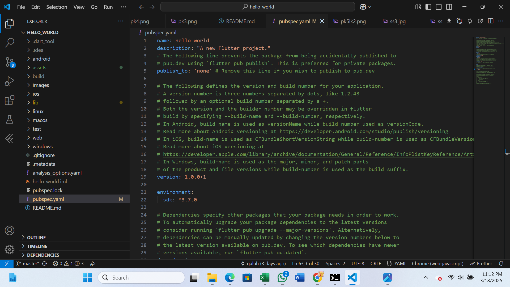
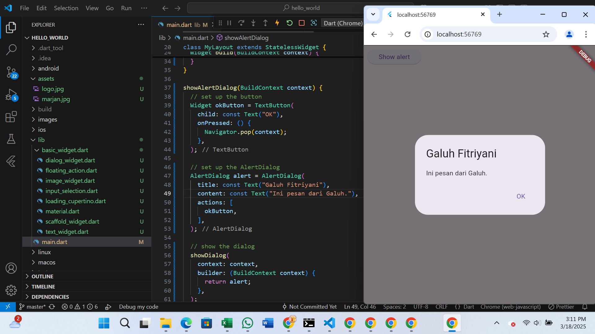

# hello_world

Galuh Fitriyani
230444040012

Gambar berupa hasil web chrome dan device android

A new Flutter project.

Praktikum1
membuat project flutter baru dengan menekan CTRL + SHIFT + P, lalu berikan nama project dan tunggu sebentar, maka akan muncul pesan "Your Flutter Project is ready!" jika project sudah berhasil dibuat

praktikum 2
menampilkan gambar hasil capture di perangkat android saya, bukti bahwa sudah terhubung

Praktikum3
menampilkan gambar bahwa project berhasil di running pada web browser (chrome) dan device android

 
Praktikum 4
mengubah isi widget atau isi textwidget

 
memberikan gambar pada isi widget

saya tidak mengerti mengapa di device tidak muncul gambar padahal di browser muncul, sudah saya cari permasalahan nya pun tetap tidak mau  muncul gambar nya

Praktikum 5
mengubah isi widget menjadi tampilan loading pada web dan device android

Untuk bagian ini saya masih belum terlalu mengerti bagaimana code nya yang benar sehingga menghasilkan hasil akhir seperti ini, sudah saya search browser dan mengikuti intruksi di browser pun tetap tidak mau berubah

mengubah isi widget menjadi terdapat tombol plus dibagian bawah widget

mengubah isi widget dan menampilkan tombol "show alert" ketika tombol tersebut di klik akan menampilkan pesan melayang

mengubah isi widget dengan menampilkan kolom yang dapat diisi dengan text apa saja

mengubah isi widget dengan tampilan tanggal dan tombol yang ketika di klik muncul kalender

