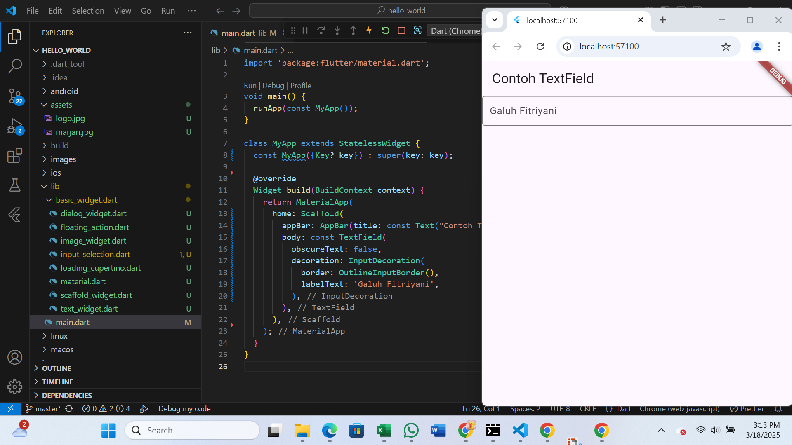

# hello_world

Galuh Fitriyani
230444040012

A new Flutter project.

Praktikum1
membuat project flutter baru dengan menekan CRTRL + SHIFT + P, lalu berikan nama roject dan tunggu sebentar, maka akan muncul pesan "Your Flutter Project is ready!" jika project sudah berhasil dibuat

praktikum 2
menampilkan gambar hasil capture di perangkat android saya, bukti bahwa sudah terhubung

Praktikum3
menampilkan gambar bahwa project berhasil di running pada web browser (chrome)

Praktikum 4
mengubah isi widget atau isi textwidget

memberikan gambar pada isi widget

Praktikum 5
mengubah isi widget menjadi tampilan loading

mengubah isi widget menjadi terdapat tombol plus dibagian bawah widget

mengubah isi widget dan menampilkan tombol "show alert" ketika tombol tersebut di klik akan menampilkan pesan melayang

mengubah isi widget dengan menampilkan kolom yang dapat diisi dengan text apa saja

mengubah isi widget dengan tampilan tanggal dan tombol yang ketika di klik muncul kalender
